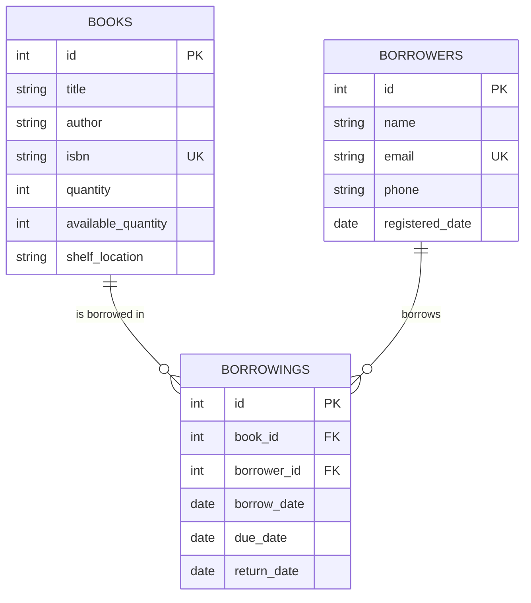

# 📚 Bosta Library Management System

A comprehensive RESTful API for library management built with Node.js, Express.js, and PostgreSQL. This system provides complete functionality for managing books, borrowers, borrowings, and generating detailed analytics reports.

[](https://nodejs.org/)
[](https://expressjs.com/)
[](https://postgresql.org/)
[](https://sequelize.org/)
[](https://opensource.org/licenses/MIT)

## 🚀 Features

- **📖 Book Management**: Complete CRUD operations with search and availability tracking
- **👥 Borrower Management**: Full borrower profile management
- **📋 Borrowing System**: Track loans, due dates, returns, and overdue items
- **📊 Analytics & Reports**: Comprehensive CSV analytics with trends and statistics
- **🔒 Security**: Rate limiting, input sanitization, and secure headers
- **⚡ Performance**: Caching system for improved response times
- **📚 API Documentation**: Well-documented RESTful endpoints

## 🛠️ Quick Start

### Prerequisites
- Node.js (v18+)
- PostgreSQL (v13+)
- npm

### Installation

1. **Clone the repository**
   ```bash
   git clone https://github.com/Kareem-Khaled/Bosta-Library-Management-System.git
   cd Bosta-Library-Management-System
   ```

2. **Install dependencies**
   ```bash
   npm install
   ```

3. **Environment configuration**
   ```bash
   # Create .env file
   cp .env.example .env
   ```
   
   Configure your `.env` file:
   ```env
   DB_HOST=localhost
   DB_PORT=5432
   DB_NAME=library_management
   DB_USER=your_username
   DB_PASSWORD=your_password
   PORT=3000
   NODE_ENV=development
   ```

4. **Database setup**
   ```bash
   npm run init-db    # Initialize database
   npm run sync-db    # Sync models
   ```

5. **Start the server**
   ```bash
   npm start          # Production
   npm run dev        # Development
   ```

🎉 **Server running at** `http://localhost:3000`

## 📡 API Endpoints

### Books
| Method | Endpoint | Description |
|--------|----------|-------------|
| `GET` | `/api/books` | Get all books |
| `GET` | `/api/books?search=title` | Search books |
| `GET` | `/api/books?available=true` | Get available books |
| `GET` | `/api/books/:id` | Get book by ID |
| `POST` | `/api/books` | Create new book |
| `PUT` | `/api/books/:id` | Update book |
| `DELETE` | `/api/books/:id` | Delete book |

### Borrowers
| Method | Endpoint | Description |
|--------|----------|-------------|
| `GET` | `/api/borrowers` | Get all borrowers |
| `GET` | `/api/borrowers/:id` | Get borrower by ID |
| `POST` | `/api/borrowers` | Create new borrower |
| `PUT` | `/api/borrowers/:id` | Update borrower |
| `DELETE` | `/api/borrowers/:id` | Delete borrower |

### Borrowings
| Method | Endpoint | Description |
|--------|----------|-------------|
| `GET` | `/api/borrowings` | Get all borrowings |
| `GET` | `/api/borrowings?book_id=1` | Filter borrowings by book |
| `GET` | `/api/borrowings?borrower_id=5` | Filter borrowings by borrower |
| `GET` | `/api/borrowings?status=active` | Filter by status (active/returned) |
| `GET` | `/api/borrowings/:id` | Get borrowing by ID |
| `GET` | `/api/borrowings/overdue` | Get overdue borrowings |
| `POST` | `/api/borrowings` | Create new borrowing |
| `PUT` | `/api/borrowings/:id/return` | Return a book |
| `DELETE` | `/api/borrowings/:id` | Delete borrowing |

### Reports & Analytics
| Method | Endpoint | Description |
|--------|----------|-------------|
| `GET` | `/api/reports/borrowing-analytics` | Generate comprehensive CSV analytics |
| `GET` | `/api/reports/quick-stats` | Get quick statistics |
| `GET` | `/api/reports/download/:fileName` | Download generated reports |

## � Analytics & Reports

Generate comprehensive analytics reports in CSV format including:

- **Summary Statistics**: Total borrowings, active loans, return rates
- **Top Books**: Most borrowed books with counts
- **Top Borrowers**: Most active library users
- **Monthly Trends**: Borrowing patterns over time
- **Overdue Tracking**: Books past due date

### Example: Generate Analytics Report
```bash
curl -X GET "http://localhost:3000/api/reports/borrowing-analytics?startDate=2025-01-01&endDate=2025-07-31"
```

**Response:**
```json
{
  "success": true,
  "message": "Borrowing analytics CSV report generated successfully",
  "fileName": "borrowing-analytics-2025-01-01-to-2025-07-31-2025-08-01.csv",
  "downloadUrl": "/api/reports/download/borrowing-analytics-2025-01-01-to-2025-07-31-2025-08-01.csv",
  "analytics": {
    "period": { "start": "2025-01-01", "end": "2025-07-31" },
    "totalBorrowings": 150,
    "activeBorrowings": 25,
    "returnedBorrowings": 125,
    "uniqueBorrowers": 45,
    "topBook": "The Great Gatsby",
    "topBorrower": "John Doe"
  }
}
```

## � Usage Examples

### Create a Book
```bash
curl -X POST http://localhost:3000/api/books \
  -H "Content-Type: application/json" \
  -d '{
    "title": "The Great Gatsby",
    "author": "F. Scott Fitzgerald",
    "isbn": "9780743273565",
    "quantity": 5,
    "shelf_location": "A-101"
  }'
```

### Create a Borrower
```bash
curl -X POST http://localhost:3000/api/borrowers \
  -H "Content-Type: application/json" \
  -d '{
    "name": "John Doe",
    "email": "john@example.com",
    "phone": "+1234567890"
  }'
```

### Borrow a Book
```bash
curl -X POST http://localhost:3000/api/borrowings \
  -H "Content-Type: application/json" \
  -d '{
    "book_id": 1,
    "borrower_id": 1,
    "due_date": "2025-08-15"
  }'
```

### Filter Borrowings
```bash
# Get all borrowings
curl -X GET http://localhost:3000/api/borrowings

# Filter by specific book
curl -X GET "http://localhost:3000/api/borrowings?book_id=1"

# Filter by specific borrower
curl -X GET "http://localhost:3000/api/borrowings?borrower_id=5"

# Filter by status (active = not returned, returned = already returned)
curl -X GET "http://localhost:3000/api/borrowings?status=active"
curl -X GET "http://localhost:3000/api/borrowings?status=returned"

# Combine filters
curl -X GET "http://localhost:3000/api/borrowings?book_id=1&status=active"
```

## 🏗️ Architecture

```
src/
├── database/          # Database configuration
├── middleware/        # Security, caching, error handling
├── models/           # Sequelize ORM models
├── routes/           # API endpoints
├── services/         # Business logic
└── server.js         # Application entry point
```

## 🔒 Security Features

- **Rate Limiting**: 100 requests per 15 minutes per IP
- **Input Sanitization**: Protection against XSS and injection attacks
- **CORS**: Configured cross-origin resource sharing
- **Helmet**: Security headers middleware
- **Error Handling**: Secure error responses without sensitive data exposure

## 🧪 Development

### Available Scripts
```bash
npm start             # Start production server
npm run dev           # Development with auto-reload
npm run init-db       # Initialize database
npm run sync-db       # Sync database models
npm test              # Run tests
```

### Database Schema

## 🗄️ Database Design

The system uses PostgreSQL with Sequelize ORM for robust data management. The database consists of three main entities with well-defined relationships.

### 📚 Books Table
| Field | Type | Constraints | Description |
|-------|------|-------------|-------------|
| `id` | INTEGER | PRIMARY KEY, AUTO_INCREMENT | Unique book identifier |
| `title` | VARCHAR(255) | NOT NULL | Book title |
| `author` | VARCHAR(255) | NOT NULL | Book author |
| `isbn` | VARCHAR(13) | UNIQUE, NOT NULL | International Standard Book Number |
| `quantity` | INTEGER | NOT NULL, DEFAULT 1 | Total copies owned by library |
| `available_quantity` | INTEGER | NOT NULL, DEFAULT 1 | Copies currently available for borrowing |
| `shelf_location` | VARCHAR(100) | OPTIONAL | Physical location in library |
| `created_at` | TIMESTAMP | AUTO | Record creation timestamp |
| `updated_at` | TIMESTAMP | AUTO | Last update timestamp |

**Business Rules:**
- `available_quantity` ≤ `quantity` (enforced by validation)
- `isbn` must be 10 or 13 digits
- `quantity` and `available_quantity` must be ≥ 0

### 👥 Borrowers Table
| Field | Type | Constraints | Description |
|-------|------|-------------|-------------|
| `id` | INTEGER | PRIMARY KEY, AUTO_INCREMENT | Unique borrower identifier |
| `name` | VARCHAR(255) | NOT NULL | Borrower's full name |
| `email` | VARCHAR(255) | UNIQUE, NOT NULL | Contact email address |
| `phone` | VARCHAR(20) | OPTIONAL | Contact phone number |
| `registered_date` | DATE | DEFAULT CURRENT_DATE | Registration date |
| `created_at` | TIMESTAMP | AUTO | Record creation timestamp |
| `updated_at` | TIMESTAMP | AUTO | Last update timestamp |

**Business Rules:**
- `email` must be valid email format
- `phone` must follow international format (+country code)
- Each borrower must have unique email

### 📋 Borrowings Table
| Field | Type | Constraints | Description |
|-------|------|-------------|-------------|
| `id` | INTEGER | PRIMARY KEY, AUTO_INCREMENT | Unique borrowing record identifier |
| `book_id` | INTEGER | FOREIGN KEY → books.id | Reference to borrowed book |
| `borrower_id` | INTEGER | FOREIGN KEY → borrowers.id | Reference to borrower |
| `borrow_date` | DATE | NOT NULL, DEFAULT CURRENT_DATE | Date book was borrowed |
| `due_date` | DATE | NOT NULL | Date book should be returned |
| `return_date` | DATE | OPTIONAL | Actual return date (NULL = not returned) |
| `created_at` | TIMESTAMP | AUTO | Record creation timestamp |
| `updated_at` | TIMESTAMP | AUTO | Last update timestamp |

**Business Rules:**
- `due_date` must be after `borrow_date`
- `return_date` must be after or equal to `borrow_date`
- When `return_date` is NULL, the book is still borrowed
- A book can only be borrowed if `available_quantity` > 0

### � Entity Relationships



### � Database Indexes

**Performance Optimization:**
- `books.isbn` - UNIQUE index for fast ISBN lookups
- `borrowers.email` - UNIQUE index for authentication/lookup
- `borrowings.book_id` - Index for filtering by book
- `borrowings.borrower_id` - Index for filtering by borrower
- `borrowings.return_date` - Index for overdue queries
- `borrowings.due_date` - Index for due date queries

### 🚀 Database Operations

**Automatic Triggers:**
- When a book is borrowed: `books.available_quantity -= 1`
- When a book is returned: `books.available_quantity += 1`
- Prevent borrowing if `available_quantity = 0`

**Data Integrity:**
- Foreign key constraints ensure referential integrity
- Check constraints prevent negative quantities
- Unique constraints prevent duplicate ISBNs and emails

---