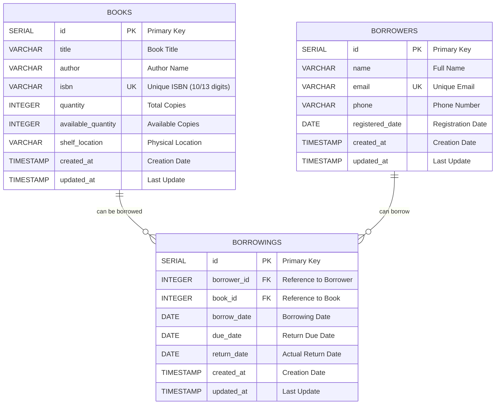

# Library Management System - Database Schema Diagram

## Entity Relationship Diagram (ERD)



## Database Constraints

### Books Table Constraints
- **Primary Key**: `id` (auto-increment)
- **Unique Constraint**: `isbn` (no duplicate books)
- **Check Constraints**:
  - `quantity > 0` (must have at least 1 copy)
  - `available_quantity >= 0` (cannot be negative)
  - `available_quantity <= quantity` (available cannot exceed total)
  - `isbn ~ '^[0-9]{10}$|^[0-9]{13}$'` (valid ISBN format)

### Borrowers Table Constraints
- **Primary Key**: `id` (auto-increment)
- **Unique Constraint**: `email` (no duplicate emails)
- **Check Constraints**:
  - `email ~* '^[A-Za-z0-9._%+-]+@[A-Za-z0-9.-]+\.[A-Za-z]{2,}$'` (valid email format)

### Borrowings Table Constraints
- **Primary Key**: `id` (auto-increment)
- **Foreign Keys**:
  - `borrower_id` → `borrowers(id)` ON DELETE CASCADE
  - `book_id` → `books(id)` ON DELETE CASCADE
- **Check Constraints**:
  - `due_date > borrow_date` (due date must be after borrow date)
  - `return_date IS NULL OR return_date >= borrow_date` (return date logic)

## Performance Indexes

### Books Table Indexes
- `idx_books_isbn` - Unique index on ISBN for fast lookups
- `idx_books_title` - Full-text search index on title
- `idx_books_author` - Full-text search index on author
- `idx_books_available` - Partial index on available books only

### Borrowers Table Indexes
- `idx_borrowers_email` - Unique index on email for authentication
- `idx_borrowers_name` - Full-text search index on name

### Borrowings Table Indexes
- `idx_borrowings_borrower_id` - Foreign key index
- `idx_borrowings_book_id` - Foreign key index
- `idx_borrowings_return_date` - Index for overdue queries
- `idx_borrowings_due_date` - Index for due date queries
- `idx_borrowings_active` - Partial index on active borrowings only

## Business Logic Triggers

### Automatic Timestamp Updates
- All tables have `updated_at` triggers that automatically update the timestamp on any row modification

### Data Integrity Rules
1. **Book Availability**: When a book is borrowed, `available_quantity` decreases
2. **Book Return**: When a book is returned, `available_quantity` increases
3. **Constraint Enforcement**: Database constraints prevent invalid states
4. **Cascading Deletes**: Deleting a book/borrower removes associated borrowings

## Sample Data Structure

### Books Sample
```sql
id | title           | author              | isbn          | quantity | available_quantity | shelf_location
1  | The Great Gatsby| F. Scott Fitzgerald| 9780743273565 | 5        | 5                 | A-101
2  | 1984           | George Orwell       | 9780451524935 | 4        | 3                 | B-201
```

### Borrowers Sample
```sql
id | name      | email                 | phone        | registered_date
1  | John Doe  | john.doe@example.com  | +1234567890  | 2025-07-01
2  | Jane Smith| jane.smith@example.com| +1987654321  | 2025-07-02
```

### Borrowings Sample
```sql
id | borrower_id | book_id | borrow_date | due_date   | return_date
1  | 1          | 2       | 2025-07-15  | 2025-07-29 | NULL
2  | 2          | 1       | 2025-07-20  | 2025-08-03 | 2025-07-25
```

## Database Size Estimates

### Storage Requirements
- **Books**: ~500 bytes per record
- **Borrowers**: ~300 bytes per record  
- **Borrowings**: ~200 bytes per record
- **Indexes**: ~30% overhead

### Scalability Considerations
- Designed to handle 100,000+ books
- Support for 50,000+ borrowers
- Efficient for 1M+ borrowing transactions
- Optimized queries for real-time performance
